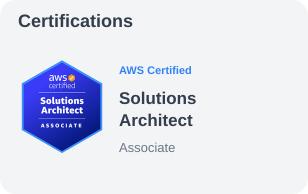
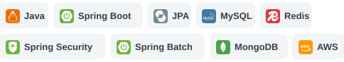

<picture>
  <source media="(max-width: 600px) and (prefers-color-scheme: dark)" srcset="assets/header-mobile-dark.svg" />
  <source media="(max-width: 600px)" srcset="assets/header-mobile-light.svg" />
  <source media="(prefers-color-scheme: dark)" srcset="assets/header-dark.svg" />
  
</picture>

<h3>Algorithm</h3>

  
  &ensp;
  <a href="https://aws.amazon.com/certification/certified-solutions-architect-associate/" title="AWS SAA certification information">
    <picture>
      <source media="(max-width: 600px) and (prefers-color-scheme: dark)" srcset="assets/certification-mobile-dark.svg" />
      <source media="(max-width: 600px)" srcset="assets/certification-mobile-light.svg" />
      <source media="(prefers-color-scheme: dark)" srcset="assets/certification-dark.svg" />
      
    </picture>
  </a>

<h3>Tech Stacks</h3>

  <picture>
    <source media="(prefers-color-scheme: dark)" srcset="assets/stack-dark.svg" />
    
  </picture>

<h3>Contact</h3>

  

