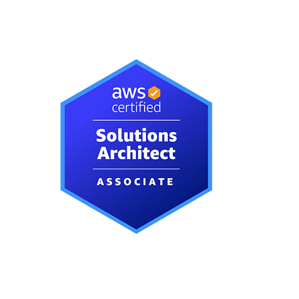

<picture>
  <source media="(max-width: 600px) and (prefers-color-scheme: dark)" srcset="assets/ui/editorial-mobile-dark.svg" />
  <source media="(max-width: 600px)" srcset="assets/ui/editorial-mobile-light.svg" />
  <source media="(prefers-color-scheme: dark)" srcset="assets/ui/editorial-dark.svg" />
  
</picture>

<h3>Intro</h3>

* 안정적인 서비스를 만들기 위해 노력하는 백엔드 개발자입니다.
* 원인을 분석하고 유지보수하기 좋은 코드를 고민합니다.

<h3>Algorithm</h3>

  

<h3>Tech Stacks</h3>

  <picture>
    <source media="(prefers-color-scheme: dark)" srcset="assets/ui/stack-dark.svg" />
    
  </picture>

<h3>Certifications</h3>

  
  

<table>
  <thead>
    <tr>
      <th>자격증</th>
      <th>자격번호</th>
      <th>취득일</th>
    </tr>
  </thead>
  <tbody>
    <tr>
      <td>AWS Certified Generative AI Developer - Professional</td>
      <td><code>73fbea3a7a844f8181a13d759cdc8cdb</code></td>
      <td>2026.10.04</td>
    </tr>
    <tr>
      <td>AWS Certified Solutions Architect - Associate</td>
      <td><code>ee9a948a767e46b190d480d82245c0e5</code></td>
      <td>2026.09.27</td>
    </tr>
    <tr>
      <td>SQLD</td>
      <td><code>SQLD-056012985</code></td>
      <td>2025.04.04</td>
    </tr>
    <tr>
      <td>정보처리기사</td>
      <td><code>24202010905E</code></td>
      <td>2024.09.10</td>
    </tr>
  </tbody>
</table>

<h3>Experience</h3>

<table>
  <thead>
    <tr>
      <th>활동</th>
      <th>내용</th>
      <th>기간</th>
    </tr>
  </thead>
  <tbody>
    <tr>
      <td>삼성청년SW·AI아카데미(SSAFY)</td>
      <td>Java Track 진행 중</td>
      <td>2026.07 ~ 현재</td>
    </tr>
    <tr>
      <td>LG U+ 유레카 백엔드 과정</td>
      <td>백엔드 과정 수료</td>
      <td>2025.01 ~ 2025.08</td>
    </tr>
    <tr>
      <td>아주대학교</td>
      <td>수학과 주전공 · 소프트웨어 복수전공</td>
      <td>2018.03 ~ 2024.02</td>
    </tr>
  </tbody>
</table>

<h3>Awards</h3>

<table>
  <thead>
    <tr>
      <th>수상</th>
      <th>내용</th>
      <th>수상일</th>
    </tr>
  </thead>
  <tbody>
    <tr>
      <td>LG U+ 유레카 종합 프로젝트 우수상</td>
      <td>U-FIT · 통신성향 파악 및 요금제 추천 챗봇 서비스</td>
      <td>2025.06</td>
    </tr>
  </tbody>
</table>
